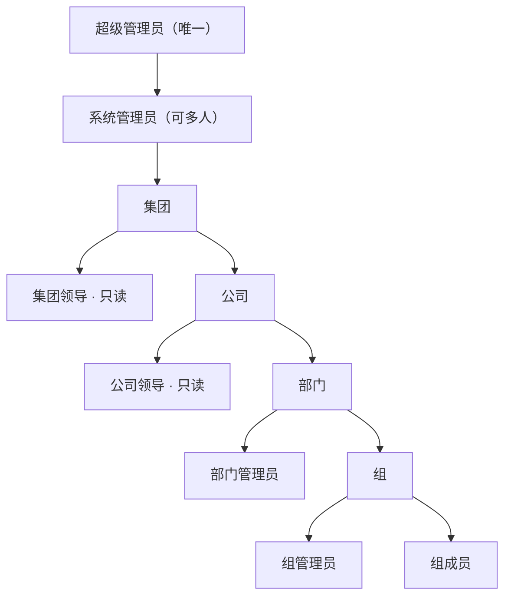

# 集团权限架构

草案。用来整理权限示意图，尚未实现。当前桌面端已有 `super_admin`、`system_admin` 与 `member`。登录走 VPS 上的 Go（`https://api.powersource.work`），资料表由桌面端用用户 JWT 直连 `https://supabase.powersource.work`。GeoCRM 的 `.app` 只作行为参考，不共用账号和库。公司 / 部门 / 组树尚未实现。

本文分三块：原图转写、整理后的模型、第一版范围。文末「已决」已拍板，可按此开表结构。

## 1. 原图转写

原图把组织节点和岗位画在同一条竖线上，原意如下。

```text
超级管理员 ──► 系统管理员
        │
        ├── 集团领导（仅集团只读）
        ▼
       公司 ──────────────── 公司领导（仅公司只读）
        │
        ▼
    部门管理员
        │
        ▼
     组管理员
        │
        ▼
      组成员
```

| 原图节点 | 原图说明 |
| --- | --- |
| 超级管理员、系统管理员 | 增删查改；可查看全部组。超级管理员唯一，系统管理员可多人。 |
| 公司 | 判断使用者属于哪一家公司。 |
| 集团领导 | 仅集团只读。挂在管理员与公司之间。 |
| 公司领导 | 仅公司只读。挂在公司与部门管理员之间。 |
| 部门管理员 | 对本部门全部资料增删查改；桌面应用与权限由上级管理员分配。 |
| 组管理员 | 可查看本部门全部资料，仅对本组增删查改；桌面应用与权限由上级管理员分配。 |
| 组成员 | 默认只读；增删查改须由上级管理员授予。 |

原图已定、整理时保留的原则：

- 超级管理员唯一；系统管理员可多人。
- 领导岗默认只读，不负责日常增删。
- 组成员默认只读，写入要另授；只读可看本部门内各组资料（含草稿），不能跨部门、不能跨公司。
- 桌面应用对组织岗不是角色自带的，要上级发放；平台岗（超级管理员、系统管理员）自带全部应用与全部资料权限。
- 组管理员的「能改」仍只限本组；「能看」与组员相同，都是本部门跨组。

## 2. 整理后的模型

实现时拆成两层，不要把「公司」当成一种角色。

1. **组织树**：人属于哪些节点。
2. **岗位**：人在某个节点上担任什么职务。
3. **授权**：在某个节点上，对某个应用，能读到哪一层、能写到哪一层。

同一人可以在**同一家公司**内挂多个岗位（例如本公司领导 + 某部门管理员）。第一版不允许一人同时属于两家公司；表也按「一账号一公司」约束，不要预留跨公司兼岗。

### 2.1 组织树

```text
集团
 └── 公司
      └── 部门
           └── 组（团队）
```

- **集团**：整棵树的根。不是岗位。
- **公司**：资料隔离的主边界。每个组织岗账号同一时间只属于一家公司。
- **部门**：公司下的管理单元。
- **组**：最小协作单元。口语里的「组」一律指这一层，不要和「集团」混用。

系统里应有且仅有一个集团根节点。超级管理员与系统管理员在集团层工作，不「属于某一组」才有全树权限。

### 2.2 岗位

岗位分两类。

**平台岗**（挂在集团，不随公司变）：

| 岗位 | 人数 | 职责 |
| --- | --- | --- |
| 超级管理员 | 1 | 破窗账号。权限覆盖系统管理员的全部能力，并单独负责：任命 / 撤销系统管理员、把本岗交给另一个已有账号、关停账号体系。 |
| 系统管理员 | 多人 | 全部权限：所有桌面应用、全树资料读写、建公司 / 部门 / 组、发应用、派岗位。不依赖应用发放表。不能交接或撤销超级管理员。 |

**组织岗**（挂在某个公司 / 部门 / 组节点上）：

| 岗位 | 挂在 | 默认读 | 默认写 |
| --- | --- | --- | --- |
| 集团领导 | 集团 | 全集团 | 无 |
| 公司领导 | 公司 | 该公司整棵子树 | 无 |
| 部门管理员 | 部门 | 该部门整棵子树 | 该部门整棵子树 |
| 组管理员 | 组 | 本部门全部组（含草稿） | 仅该组 |
| 组成员 | 组 | 本部门全部组（含草稿） | 无（须另授；写仍只限本组） |

没有「公司管理员」节点。公司范围的经营查看走公司领导；公司范围的搭建与授权走系统管理员。若以后要让某公司自己管部门，再加「公司管理员」，不要把系统管理员下放到公司。

### 2.3 一张授权等于什么

每一次有效权限是下面这一组字段，而不是角色名上的一句「增删查改」。

| 字段 | 含义 |
| --- | --- |
| 主体 | 哪个账号 |
| 岗位 | 上表中的一种 |
| 节点 | 集团 / 某公司 / 某部门 / 某组 |
| 应用 | 桌面里的一个应用（含搜索、设置里的管理页） |
| 读范围 | `none` / `group` / `department` / `company` / `holding` |
| 写范围 | 同上；写范围不得宽于读范围 |
| 写动作 | 分 `create` / `update` / `delete`，不要捆成一个开关 |

组管理员与组员的读范围都是部门（本部门跨组，含未发布草稿）；组管理员写范围 = 组，组员写范围默认无，上级再按应用打开本组的 `create` / `update` / `delete`。

「资料」第一版按**应用**切。组织岗没有发放到的应用：主页无入口，接口拒绝，旧数据也不可见。平台岗不走发放表，始终能进全部应用、看见全部资料。

### 2.4 整理后的关系



## 3. 谁可以管人、建组织

原图没画这一层，实现时必须有，否则邀请和调岗会各写一套。

| 动作 | 超级管理员 | 系统管理员 | 部门管理员 | 组管理员 | 领导岗 | 组成员 |
| --- | --- | --- | --- | --- | --- | --- |
| 把超级管理员岗交给另一账号 | 是 | 否 | 否 | 否 | 否 | 否 |
| 任命 / 撤销系统管理员 | 是 | 否 | 否 | 否 | 否 | 否 |
| 建公司、建部门、建组 | 是 | 是 | 否 | 否 | 否 | 否 |
| 邀请入职、停用账号 | 是 | 是 | 否 | 否 | 否 | 否 |
| 把人派进某部门 / 某组 | 是 | 是 | 本部门 | 本组 | 否 | 否 |
| 任命本部门的组管理员 | 是 | 是 | 是 | 否 | 否 | 否 |
| 给下属发桌面应用 / 写权限 | 是 | 是 | 本部门 | 本组 | 否 | 否 |
| 给自己加权限 | 是 | 是 | 否 | 否 | 否 | 否 |

部门管理员不能创建新部门。组管理员不能创建新组。领导岗不能发邀请、不能发应用。

超级管理员交接：在任者把该岗指派给另一个已有账号即可，系统里始终只有一个超级管理员（指派时原子替换）。不必改服务器引导名单。

公司领导可以兼任**本公司**的部门管理员。此时读权限取并集，写权限以部门管理员为准。

停用账号后：会话立刻失效；岗位保留但全部授权视为无效，便于以后复职。

## 4. 桌面应用

应用目录与组织树独立。组织岗不自动带齐全部应用；超级管理员与系统管理员自带全部应用，不需要发放记录。

发放规则：

- 系统管理员（及超级管理员）可以把任意应用发给任意组织岗 / 任意人。
- 部门管理员只能把**自己已拥有**的应用，发给本部门的组管理员与组员。
- 组管理员只能把**自己已拥有**的应用，发给本组组员。
- 不能把应用向上级或向兄弟部门发放。
- 收回应用后：入口消失；该人对该应用的旧数据也不可见。库中记录不删，其他仍持有该应用的人不受影响。

组成员对某个应用的写动作（增 / 改 / 删）要单独勾，默认全关。

设置里的「组织与权限」本身也是一个应用，默认只给平台岗。

## 5. 读 / 写对照

组织岗按「某个已发放的应用」理解，未发放则整行不适用（含旧数据不可见）。平台岗不看发放表。

| 岗位 | 读 | 写 |
| --- | --- | --- |
| 超级管理员 | 全集团，全部应用 | 全集团，含把本岗交给另一账号 |
| 系统管理员 | 全集团，全部应用 | 全集团，不含交接 / 撤销超级管理员 |
| 集团领导 | 全集团 | 无 |
| 公司领导 | 该公司 | 无；兼任部门管理员时写以该管理员岗为准 |
| 部门管理员 | 该部门 | 该部门 |
| 组管理员 | 该部门（跨组，含草稿） | 仅该组 |
| 组成员 | 该部门（跨组，含草稿） | 无，除非上级按应用打开本组的 create / update / delete |

领导岗的只读包含列表、详情与检索，**不包含**导出、打印、批量下载，除非以后单独开「导出」动作。

搜索不得宽于读范围：组员 / 组管理员只能搜到本部门；不能靠搜索看到其他部门或公司。平台岗可搜全树。

## 6. 第一版范围

当前工作台只有桌面、搜索、设置。第一版实现下面这些就够，不要一次做完整 IAM。

要做：

- 组织树四层，集团根唯一。
- 平台岗 2 个 + 组织岗 5 个。
- 一人一家公司；同一公司内可兼多个组织岗（例如公司领导 + 部门管理员）。
- 应用发放 + 组成员的 create / update / delete。平台岗不走发放表。
- 邀请、停用、调岗；超级管理员把本岗交给另一个已有账号。
- 接口按「读范围 / 写范围 / 写动作」鉴权；搜索结果不得宽于读范围。

明确不做（第二版）：

- 公司管理员（公司自治）。
- 部门领导（与部门管理员分开的只读岗）。
- 一人多公司。
- 跨组点对点分享、临时授权、审批流。（本部门内跨组只读已包含在第一版。）
- 外部访客 / 外包账号。
- 敏感域（人事薪资等）与普通资料分域。
- 代理登录、自动化账号（Agent 以某人身份办事）。

## 7. 与现状的差距

| 现状（`work_profiles.role`） | 目标 |
| --- | --- |
| `super_admin`（已挂 CRM 账号）+ `system_admin` \| `member` | 第 2.2 节其余组织岗 |
| 无组织表 | 集团 / 公司 / 部门 / 组 |
| 邀请只建账号 | 邀请时写入公司（以及可选部门 / 组） |
| 无应用目录 | 桌面应用发放表 |
| 无读写范围 | 按应用的读范围、写范围、写动作 |

GeoCRM 的组隔离和 `group_desktop_writes_*` 只作行为参考，不要把 CRM 模块或旧权限编辑器搬进工作台。

## 8. 已决

| # | 问题 | 结论 |
| --- | --- | --- |
| 1 | 超级管理员交接 | 把该岗交给另一个已有账号即可，原子替换，始终一人。不必改服务器引导名单。 |
| 2 | 系统管理员与未发放的应用 | 系统管理员有全部权限：全部应用、全部资料，不看发放表。超级管理员同样覆盖。 |
| 3 | 收回应用后的旧数据 | 对该人不可见。记录不删。 |
| 4 | 跨组可见范围 | 组成员即可本部门跨组只读，含草稿 / 未发布。不能跨部门、不能跨公司。 |
| 5 | 一人多公司 | 不允许。一账号同一时间只属于一家公司；该公司内可兼多岗。 |
| 6 | 搜索是否跨越读范围 | 不能。搜索结果不得宽于该用户在对应应用上的读范围。 |
| 7 | 公司领导兼任部门管理员 | 允许（仅本公司）。读取并集，写以部门管理员岗为准。 |
